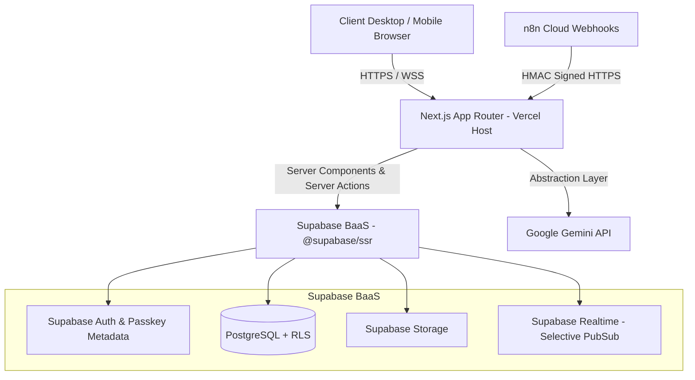

# PERSONAL OS — SYSTEM ARCHITECTURE SPECIFICATION

## 1. TỔNG QUAN KIẾN TRÚC (SYSTEM OVERVIEW)

PERSONAL OS được thiết kế theo kiến trúc **Modern Full-Stack Web Application** dựa trên Next.js App Router (Phiên bản Stable hiện hành), kết hợp với Supabase BaaS (sử dụng `@supabase/ssr`) và n8n Cloud.

---

## 2. KIẾN TRÚC TIMER — SERVER SOURCE OF TRUTH

- **Nguyên tắc**: `Database/Server` là NGUỒN SỰ THẬT DUY NHẤT (Source of truth). `localStorage` chỉ được dùng phục hồi UX khi reload hoặc gián đoạn mạng.
- **Tính toán thời gian**: Số giây tích lũy (`duration`) được tính toán trực tiếp từ chênh lệch timestamp (`ended_at - started_at` hoặc `NOW() - started_at`). Không phụ thuộc vào đếm số giây ở frontend.
- **Ràng buộc nghiệp vụ (Server Safeguards)**:
  - Ngăn chặn duplicate active sessions (Index Unique `status = 'RUNNING'` per user).
  - Ngăn chặn negative duration.
  - Ngăn chặn overlapping sessions nếu không cho phép.
  - Khôi phục active timer từ `started_at` server khi người dùng refresh trình duyệt.

---

## 3. THIẾT KẾ AUTOMATION VỚI n8n CLOUD

Personal OS kết nối với **n8n Cloud** qua HTTPS Webhooks được bảo mật nghiêm ngặt:
- **HMAC SHA-256 Signature**: Header `X-Signature` được kiểm tra bằng `WEBHOOK_SECRET_KEY` từ ENV.
- **Timestamp & Replay Protection**: Từ chối request có timestamp lệch quá 5 phút.
- **Idempotency Key**: Đảm bảo không trùng lặp tác vụ khi retry.
- **Logging & Retry Strategy**: Ghi vết tác vụ vào bảng `automation_jobs`.

---

## 4. XÁC THỰC BẢNG PASSKEY / WEBAUTHN & FALLBACKS

1. **Email / Password** (Fallback chuẩn).
2. **Google OAuth 2.0** (Fallback tiện lợi).
3. **Passkey / WebAuthn** (Phương thức ưu tiên):
   - Wording hiển thị UI: **"Đăng nhập bằng Passkey"** (Không dùng từ ngữ kỹ thuật "Face ID login" hay "Touch ID login").
   - Face ID / Touch ID / Windows Hello chỉ đóng vai trò là platform authenticator của hệ điều hành.
   - **Bảo mật**: Tuyệt đối KHÔNG lưu trữ dữ liệu sinh trắc học (Biometric data, vân tay, khuôn mặt). Chỉ lưu metadata Public Key & Credential ID theo chuẩn WebAuthn.
   - Hỗ trợ Graceful Degradation nếu thiết bị/trình duyệt không hỗ trợ WebAuthn.

---

## 5. THIẾT KẾ AI COST CONTROL & TRACKING LAYER

Lớp trừu tượng `AIService` giao tiếp với Gemini API thông qua các phương thức nghiệp vụ:
- `summarizeNote(content: string)`
- `extractActions(content: string)`
- `analyzeRisk(content: string)`
- `generateDailyBrief(input: DailyBriefInput)`
- `generateWeeklyReview(input: WeeklyReviewInput)`

**Kiểm soát chi phí & Hiệu năng**:
- KHÔNG gọi AI khi không cần thiết hoặc mỗi khi UI re-render.
- Timeout và Error handling cho từng AI Request.
- Ghi log 100% lượng token và chi phí ước tính vào bảng `ai_usage_logs`.
