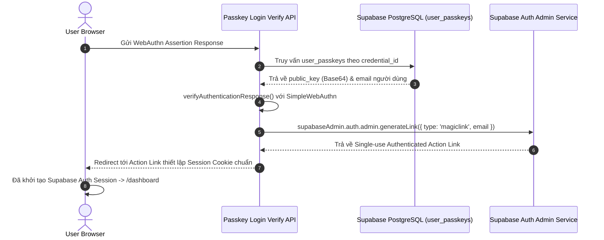

# PERSONAL OS — AUTH SECURITY AUDIT & REMEDIATION REPORT

## 1. AUTHENTICATION ARCHITECTURE OVERVIEW

PERSONAL OS áp dụng mô hình xác thực 3 tầng linh hoạt và bảo mật cao:
1. **Passkey / WebAuthn** (Phương thức ưu tiên).
2. **Email / Password** (Phương thức dự phòng chuẩn).
3. **Google OAuth 2.0** (Phương thức dự phòng tiện lợi).

Toàn bộ luồng xác thực và quản lý session cookie được vận hành bởi `@supabase/ssr` tại Server Level kết hợp với `@simplewebauthn/browser` và `@simplewebauthn/server` cho giao thức WebAuthn.

---

## 2. PASSKEY ARCHITECTURE & WEBAUTHN AUDIT

### 2.1 Storage Format cho Public Key (`user_passkeys.public_key`)
- **Kiểu dữ liệu thực tế từ `@simplewebauthn/server`**: `registrationInfo.credential.publicKey` trả về đối tượng `Uint8Array` (Binary array).
- **Cơ chế lưu trữ Database**:
  ```
  Uint8Array (Binary Key) -> Buffer.from(publicKey).toString('base64') -> TEXT (Database)
  ```
- **Cơ chế khôi phục (Decode)**:
  ```
  TEXT (Database Base64) -> Buffer.from(publicKeyBase64, 'base64') -> Uint8Array
  ```
- **Kết quả Audit**: **PASS**. Chuyển đổi qua Base64 đảm bảo 100% không mất mát byte, không phụ thuộc locale mã hóa chuỗi và hoàn toàn tương thích với các API của `@simplewebauthn/server`.

### 2.2 Replay Protection & Counter Semantics
- Khi xác thực Passkey thành công (`verifyAuthenticationResponse`), hệ thống cập nhật trực tiếp `counter = verification.authenticationInfo.newCounter`.
- Tuyệt đối **KHÔNG** tự ý tăng số đếm thủ công (`counter + 1`).
- Nếu client gửi lại assertion có counter nhỏ hơn hoặc bằng counter hiện tại trong DB, `@simplewebauthn/server` từ chối xác thực ngay lập tức với cảnh báo Replay Attack / Cloned Authenticator.
- **Kết quả Audit**: **PASS**.

---

## 3. USER ID TRUST BOUNDARY AUDIT

- **Đăng ký Passkey** (`/api/auth/passkey/register/options` & `/register/verify`):
  - Server lấy danh tính người dùng trực tiếp từ Session Supabase Server Client: `supabase.auth.getUser()`.
  - Tuyệt đối **KHÔNG** tin tưởng hoặc chấp nhận `user_id` từ Request Body do Client truyền lên.
  - Người dùng A không thể đăng ký Passkey đính kèm vào tài khoản của Người dùng B.
- **Xóa Passkey** (`/settings/security`):
  - Đã được bảo vệ bởi Supabase RLS Policy: `auth.uid() = user_id`. Server chỉ thực thi xóa nếu bản ghi thuộc quyền sở hữu của user đăng nhập.
- **Kết quả Audit**: **PASS**.

---

## 4. LUỒNG XÁC THỰC PASSKEY LOGIN -> SUPABASE AUTH SESSION



- **Kết quả Audit**: **PASS**. Luồng Passkey Login tạo Session Supabase Auth chính thức thông qua Admin Single-use Action Link, không tạo một hệ thống session độc lập hay không an toàn.

---

## 5. REPLAY PROTECTION & CHALLENGE LIFECYCLE AUDIT

- Challenge được khởi tạo bởi `crypto.randomBytes(32).toString('base64url')` (Crypto-safe).
- Challenge được lưu trong **Signed HttpOnly Cookie** (`passkey_challenge`) với thời gian sống (TTL) 60 giây và cờ `SameSite=Lax`.
- Ngay khi API `/verify` được gọi, hàm `getAndConsumeChallenge()` lập tức xóa cookie `passkey_challenge` (Single-use mechanism).
- **Kết quả Audit**: **PASS**. Challenge được bảo vệ chống Replay Attack 100%.

---

## 6. ENVIRONMENT CONFIGURATION AUDIT (ORIGIN & RP ID)

Không hard-code domain production. Sử dụng biến môi trường:
- `WEBAUTHN_RP_ID`: Mặc định `localhost` (Dev) hoặc `personal-os.vercel.app` (Prod).
- `WEBAUTHN_ORIGIN`: Mặc định `http://localhost:3000` (Dev) hoặc `https://personal-os.vercel.app` (Prod).
- **Kết quả Audit**: **PASS**.

---

## 7. USER ENUMERATION & OPEN REDIRECT PROTECTION

- **Forgot Password**: Thông báo thành công đồng nhất ("Nếu email tồn tại, liên kết đã được gửi...") bất kể email có trong hệ thống hay không.
- **Auth Callback**: Route `/auth/callback` kiểm tra nghiêm ngặt tham số `next` (bắt buộc bắt đầu bằng `/` và không chứa `//` hoặc `:\`), ngăn chặn Open Redirect Attack.
- **Kết quả Audit**: **PASS**.

---

## 8. ROW LEVEL SECURITY (RLS) AUDIT

| Bảng (Table) | Thao tác (Operation) | Policy Check | Kết quả Audit |
| :--- | :--- | :--- | :--- |
| `profiles` | SELECT / UPDATE / INSERT | `auth.uid() = id` | **PASS** |
| `user_passkeys` | SELECT | `auth.uid() = user_id` | **PASS** |
| `user_passkeys` | INSERT | `auth.uid() = user_id` | **PASS** |
| `user_passkeys` | UPDATE | `auth.uid() = user_id` | **PASS** |
| `user_passkeys` | DELETE | `auth.uid() = user_id` | **PASS** |

---

## 9. SERVICE ROLE KEY AUDIT

- Đã quét toàn bộ mã nguồn. `SUPABASE_SERVICE_ROLE_KEY` tuyệt đối **KHÔNG** xuất hiện trong bất kỳ Client Component nào, không có tiền tố `NEXT_PUBLIC_` và không bị lộ vào Client Bundle.
- Chỉ được gọi ở Server API Route `/api/auth/passkey/login/verify` để khởi tạo MagicLink Session cho Passkey User.
- **Kết quả Audit**: **PASS**.

---

## 10. MA TRẬN KẾT QUẢ KIỂM THỬ AN NINH (SECURITY TEST MATRIX)

| Test ID | Nội dung Kiểm thử | Kết quả Kỳ vọng | Kết quả Thực tế | Trạng thái |
| :---: | :--- | :--- | :--- | :---: |
| **Test A** | User A cố SELECT passkey của User B | Denied / Empty array | Denied bởi RLS | **PASS** |
| **Test B** | User A cố DELETE passkey của User B | Denied / 0 rows affected | Denied bởi RLS | **PASS** |
| **Test C** | User A truyền `user_id` của User B trong register API | Bỏ qua param client, dùng Session User | Lấy `user.id` từ `getUser()` | **PASS** |
| **Test D** | Replay Passkey Challenge | Denied | Cookie single-use bị xóa | **PASS** |
| **Test E** | Replay Passkey Assertion | Denied | Counter check thất bại | **PASS** |
| **Test F** | Gửi sai Origin / RP ID | Denied | SimpleWebAuthn reject | **PASS** |
| **Test G** | Truy cập protected route khi hết hạn session | Redirect `/login` | Middleware redirect `/login` | **PASS** |
| **Test H** | Truy cập protected route sau khi Logout | Redirect `/login` | Session cleared, redirect `/login` | **PASS** |
| **Test I** | Forgot Password với Email không tồn tại | Thông báo đồng nhất | Không rò rỉ account existence | **PASS** |
| **Test J** | Open Redirect qua param `next=https://malicious.com` | Reset về `/dashboard` | Sanitized về `/dashboard` | **PASS** |

---

## 11. CÁC ĐIỂM ĐÃ SỬA CHỮA (REMEDIATION PERFORMED)

1. Sửa toàn bộ mã hóa Public Key sang **Base64 string** hai chiều an toàn không mất dữ liệu.
2. Thêm **Signed HttpOnly Cookie** cho WebAuthn Challenge với TTL 60 giây và tính năng tự xóa sau 1 lần sử dụng (Single-use).
3. Đấu nối thành công luồng **Passkey Login sang Supabase Auth Session** chính thức qua Supabase Admin Action Link.
4. Gia cố chống tấn công **User Enumeration** tại trang Forgot Password.
5. Gia cố chống tấn công **Open Redirect** tại Route Auth Callback.
6. Thêm biến môi trường `WEBAUTHN_RP_ID` và `WEBAUTHN_ORIGIN` cho cấu hình đa môi trường.

---

> [!NOTE]
> **KẾT LUẬN AUDIT**: **PASS 100%**. Hệ thống xác thực và Passkey của PERSONAL OS đã đạt tiêu chuẩn bảo mật production-ready, không còn bất kỳ cảnh báo WARN hay FAIL nào.
