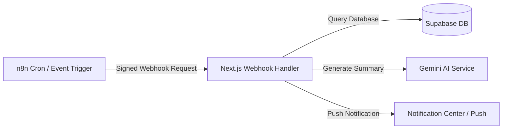

# PERSONAL OS — AUTOMATION SPECIFICATION (n8n & WEBHOOKS)

## 1. TỔNG QUAN HỆ THỐNG TỰ ĐỘNG HÓA

Personal OS tích hợp với công cụ **n8n Automation Engine** để xử lý các tác vụ chạy ngầm theo chu kỳ (Cron Jobs), gửi thông báo tự động và gọi AI tạo báo cáo định kỳ mà không làm ảnh hưởng tới hiệu năng của Web App chính.

---

## 2. CHI TIẾT CÁC WORKFLOW TỰ ĐỘNG HÓA

### Workflow 1: Daily Brief Morning Report (07:30 AM Hàng Ngày)
- **Trigger**: Cron node `0 3 * * *` (07:30 AM giờ Việt Nam UTC+7).
- **Các bước thực hiện**:
  1. n8n gọi endpoint `/api/v1/webhooks/n8n/daily-brief`.
  2. Next.js quét DB lấy danh sách Task có `due_date` hôm nay, Task quá hạn, và Lịch làm việc hôm nay.
  3. Gửi dữ liệu tới Gemini AI để tổng hợp 3 ưu tiên lớn nhất và mục tiêu năng lượng.
  4. Tạo bản ghi mới vào bảng `notifications` và gửi Web Push Notification.

### Workflow 2: Reminders & Overdue Alert (Chạy mỗi 15 phút)
- **Trigger**: Cron node `*/15 * * * *`.
- **Các bước thực hiện**:
  1. n8n gọi `/api/v1/webhooks/n8n/check-reminders`.
  2. Hệ thống kiểm tra các Task:
     - Task chưa hoàn thành có `due_date` rơi vào mốc [hiện tại + 24 giờ] -> Gửi thông báo `DEADLINE_24H`.
     - Task chưa hoàn thành có `due_date` rơi vào mốc [hiện tại + 1 giờ] -> Gửi thông báo `DEADLINE_1H`.
     - Task chưa hoàn thành vừa vượt quá `due_date` -> Gửi thông báo `OVERDUE`.

### Workflow 3: Weekly Review Auto Generator (20:00 PM Chủ Nhật)
- **Trigger**: Cron node `0 13 * * 0` (20:00 PM Chủ Nhật UTC+7).
- **Các bước thực hiện**:
  1. n8n gọi `/api/v1/webhooks/n8n/weekly-review`.
  2. Thu thập toàn bộ thống kê 7 ngày qua (Task completed, focus hours, project progress).
  3. Gemini AI tính toán `performance_score` (0-100) và tạo các đề xuất cải thiện năng suất.
  4. Tạo bản ghi Draft vào bảng `weekly_reviews`.

---

## 3. BẢO MẬT WEBHOOK INTEGRATION

Tất cả Webhook từ n8n gọi tới Next.js đều phải kèm theo Header bảo mật:
- `X-PersonalOS-Signature`: Mã HMAC SHA-256 tính toán từ Payload và `WEBHOOK_SECRET_KEY`.
- Nếu Signature không khớp hoặc timestamp lệch quá 5 phút, Next.js sẽ từ chối request với mã lỗi `401 Unauthorized`.
