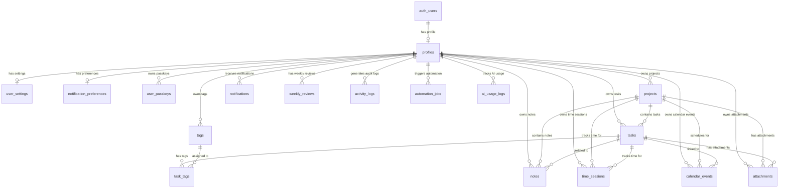

# PERSONAL OS — DATABASE SCHEMA SPECIFICATION & MERMAID ERD

## 1. MERMAID DIAGRAM THỰC THỂ NGUYÊN THỂ (ERD)



---

## 2. DANH SÁCH 17 BẢNG DỮ LIỆU & CONSTRAINTS

| Bảng (Table) | Khóa chính (PK) | RLS Check | Ghi chú & Safeguard constraints |
| :--- | :--- | :--- | :--- |
| `profiles` | `id (FK auth.users)` | `auth.uid() = id` | Hồ sơ người dùng cá nhân. |
| `user_settings` | `id (UUID)` | `auth.uid() = user_id` | Unique `user_id`. Default `vi-VN`, `Asia/Ho_Chi_Minh`. |
| `notification_preferences` | `id (UUID)` | `auth.uid() = user_id` | Unique `user_id`. Tùy chỉnh nhận thông báo 24h, 1h, overdue. |
| `projects` | `id (UUID)` | `auth.uid() = user_id` | Status CHECK, priority CHECK, progress_pct 0-100. |
| `tasks` | `id (UUID)` | `auth.uid() = user_id` | Chain ownership check nếu thuộc project của user. Status & Priority CHECK. |
| `tags` | `id (UUID)` | `auth.uid() = user_id` | Unique `(user_id, name)`. |
| `task_tags` | `(task_id, tag_id)` | Chain ownership | User phải sở hữu cả Task và Tag. |
| `notes` | `id (UUID)` | `auth.uid() = user_id` | Rich Text JSON content, AI metadata. |
| `time_sessions` | `id (UUID)` | `auth.uid() = user_id` | **Partial Unique Index**: Tối đa 1 timer `status = 'RUNNING'` per user. |
| `calendar_events` | `id (UUID)` | `auth.uid() = user_id` | Check `end_time >= start_time`. |
| `notifications` | `id (UUID)` | `auth.uid() = user_id` | Thông báo in-app. |
| `weekly_reviews` | `id (UUID)` | `auth.uid() = user_id` | Unique `(user_id, year, week_number)`. |
| `automation_jobs` | `id (UUID)` | `auth.uid() = user_id` | Unique `idempotency_key` chống trùng tác vụ n8n. |
| `ai_usage_logs` | `id (UUID)` | `auth.uid() = user_id` | Theo dõi chi phí & token Gemini AI. KHÔNG lưu prompt nhạy cảm. |
| `attachments` | `id (UUID)` | `auth.uid() = user_id` | Metadata cho Supabase Storage. Path pattern `attachments/user_id/...`. |
| `activity_logs` | `id (UUID)` | `auth.uid() = user_id` | Audit Trail. Chỉ cho phép SELECT và INSERT (Immutable). |
| `user_passkeys` | `id (UUID)` | `auth.uid() = user_id` | Unique `credential_id`. Base64 Public Key storage. |

---

## 3. THIẾT KẾ ACTIVE TIMER CONSTRAINT & SERVER SOURCE OF TRUTH

```sql
-- CHỈ CHO PHÉP 1 LIVE TIMER ĐANG CHẠY CỦA MỖI USER TẠI DATABASE LEVEL
CREATE UNIQUE INDEX idx_unique_running_session_per_user 
    ON public.time_sessions (user_id) WHERE status = 'RUNNING';
```
- Ngăn chặn triệt để tình trạng người dùng mở 2 tab và chạy 2 đồng hồ song song.
- Thời gian làm việc được tính từ mốc `NOW() - started_at` hoặc `ended_at - started_at`, không phụ thuộc số giây đếm ở client.

---

## 4. BẢO BỆ SUPABASE STORAGE ISOLATION POLICIES

- Dynamic Folder Isolation Pattern: `attachments/{user_id}/{filename}`
- Policy RLS cho Storage Objects:
  ```sql
  CREATE POLICY "Users access own storage folder"
    ON storage.objects FOR ALL
    USING (
      bucket_id = 'attachments' AND
      (storage.foldername(name))[1] = auth.uid()::text
    );
  ```
- User A tuyệt đối không thể xem, đọc hoặc xóa tệp tin trong thư mục của User B.

---

## 5. SELECTIVE REALTIME PUBSUB STRATEGY

Chỉ kích hoạt Supabase Realtime PubSub cho các bảng cần đồng bộ tức thì:
- `tasks`
- `notifications`
- `time_sessions`
- `calendar_events`
- `activity_logs`

Bảng `weekly_reviews` và Analytics không bật realtime để tiết kiệm băng thông; sử dụng TanStack Query client aggregation.
