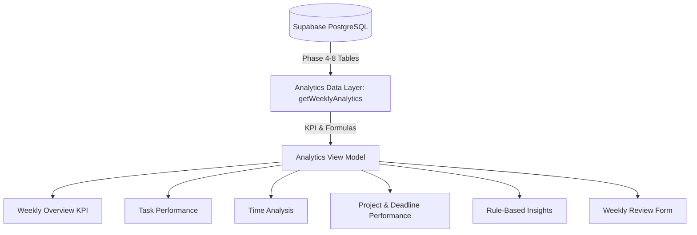

# PERSONAL OS — WEEKLY ANALYTICS MODULE SPECIFICATION & ARCHITECTURE

## 1. TỔNG QUAN KIẾN TRÚC PHÂN TÍCH TUẦN (WEEKLY ANALYTICS ARCHITECTURE)

Module Phân Tích Tuần (Weekly Analytics Module) trong Personal OS được thiết kế để đo lường và phản ánh chính xác hiệu suất làm việc, phân bổ thời gian và tiến độ công việc theo từng tuần (Thứ Hai -> Chủ Nhật, múi giờ `Asia/Ho_Chi_Minh`).

---

## 2. CÔNG THỨC CÁC CHỈ SỐ KPI CHÍNH (KPI FORMULAS)

1. **Completed Tasks**: Số Task được chuyển trạng thái `HOAN_THANH` trong khoảng thời gian tuần.
2. **Completion Rate (%)**:
   $$\text{Completion Rate} = \frac{\text{Completed Tasks}}{\text{Total Tasks Due or Created in Period}} \times 100$$
   *(Nếu Mẫu số = 0, hiển thị "N/A" thay vì 0% để tránh hiểu nhầm).*
3. **On-Time Completion Rate (%)**:
   $$\text{On-Time Rate} = \frac{\text{Tasks Completed } \le \text{ Due Date}}{\text{Tasks Completed with Due Date}} \times 100$$
   *(Nếu Mẫu số = 0, hiển thị "N/A").*
4. **Total Time & Billable Time**:
   $$\text{Total Time} = \sum \text{duration\_seconds (time\_entries)}$$
   $$\text{Billable Time} = \sum \text{duration\_seconds (WHERE is\_billable = true)}$$
5. **Percentage Change vs Previous Week**:
   $$\text{Change \%} = \frac{\text{Current} - \text{Previous}}{\text{Previous}} \times 100$$
   *(Nếu Previous = 0, hiển thị "N/A").*

---

## 3. NGUYÊN TẮC KHÔNG DÙNG AI & ZERO MIGRATION

- **Zero Database Migration**: Tái sử dụng 100% các bảng hiện có (`tasks`, `projects`, `time_entries`, `weekly_reviews`).
- **Rule-Based Insights (Không AI)**: Điểm đáng chú ý được tạo ra hoàn toàn từ các câu lệnh logic điều kiện dựa trên số liệu DB thực tế (ví dụ: Cảnh báo task quá hạn, thống kê dự án chiếm nhiều thời gian nhất).
- **Weekly Review CRUD**: Tương tác trực tiếp với bảng `weekly_reviews` có sẵn, bảo vệ bằng Supabase RLS `auth.uid() = user_id`.

---

## 4. DANH SÁCH ROUTES & COMPONENTS

### Routes:
- `/analytics` — Màn hình Phân Tích Tuần chính.

### Component Architecture:
- `lib/analytics/types.ts`
- `lib/analytics/actions.ts`
- `components/analytics/analytics-header.tsx`
- `components/analytics/weekly-overview-kpi.tsx`
- `components/analytics/task-performance-section.tsx`
- `components/analytics/time-analysis-section.tsx`
- `components/analytics/project-performance-section.tsx`
- `components/analytics/rule-based-insights-section.tsx`
- `components/analytics/weekly-review-editor.tsx`
- `app/(dashboard)/analytics/page.tsx`
