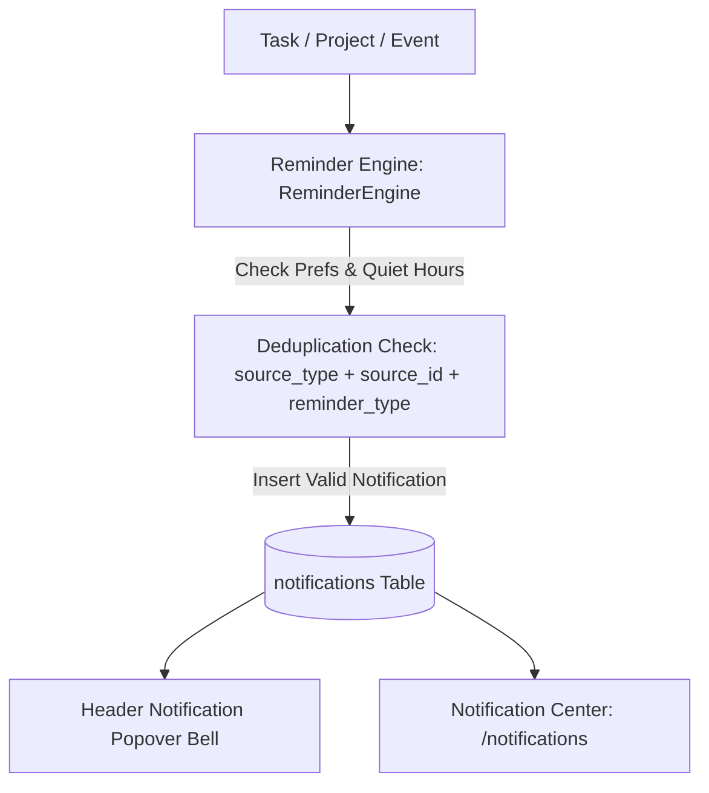

# PERSONAL OS — SMART REMINDERS MODULE SPECIFICATION & ARCHITECTURE

## 1. TỔNG QUAN KIẾN TRÚC NHẮC VIỆC THÔNG MINH (SMART REMINDERS ARCHITECTURE)

Module Nhắc Việc Thông Minh (Smart Reminders Module) trong Personal OS được thiết kế như một **Trợ lý nhắc nhở có cấu hình**, bảo đảm đưa ra đúng thông báo vào đúng thời điểm, tránh trùng lặp và tôn trọng chế độ Không làm phiền (Quiet Hours) cũng như múi giờ `Asia/Ho_Chi_Minh`.

---

## 2. NGUYÊN TẮC HOẠT ĐỘNG CỦA REMINDER ENGINE

1. **Phân biệt Reminder vs Notification**:
   - **Reminder**: Quy tắc quyết định KHI NÀO và THEO ĐIỀU KIỆN NÀO cần nhắc.
   - **Notification**: Bản ghi hiển thị người dùng nhìn thấy trong Notification Center & Header.
2. **Deduplication / Idempotency (Chống Trùng Lặp)**:
   - Logical Identity: `user_id + source_type + source_id + reminder_type`.
   - Hệ thống tự động kiểm tra bản ghi đã tồn tại trước khi tạo mới. Thao tác F5, chuyển route hoặc refresh **tuyệt đối không tạo trùng lặp**.
3. **Completion Suppression (Tự Động Trì Hoãn Khi Đã Xong)**:
   - Nếu Task đã `HOAN_THANH` hoặc Project đã kết thúc trước mốc nhắc việc, Reminder Engine sẽ tự động hủy bỏ nhắc nhở đó.
4. **Quiet Hours (Chế Độ Không Làm Phiền)**:
   - Trong khoảng thời gian Quiet Hours (ví dụ `22:00` -> `07:00`), các nhắc việc phát sinh sẽ được dời mốc `scheduled_at` về thời điểm kết thúc Quiet Hours (`07:00`).

---

## 3. DANH SÁCH ROUTES & COMPONENTS

### Routes:
- `/notifications` — Màn hình Trung tâm Thông báo (Notification Center).
- `/settings` — Trang Cấu hình Tùy chọn Nhắc việc & Quiet Hours.

### Component Architecture:
- `lib/reminders/types.ts`
- `lib/reminders/engine.ts` (Reminder Engine Core)
- `lib/reminders/actions.ts` (Server Actions với Supabase RLS)
- `components/reminders/notification-popover.tsx` (Header Bell Icon Popover với unread badge count)
- `components/reminders/notification-center.tsx` (Notification Center Hub với Tabs, Snooze, Dismiss, Deep-links)
- `components/reminders/reminder-settings-form.tsx` (Form Cấu hình Nhắc việc & Quiet Hours)
- `components/shared/header.tsx` (Tích hợp NotificationPopover vào App Shell)

---

## 4. SCHEDULER ABSTRACTION & PHẠM VI GIỚI HẠN

> [!NOTE]
> Reminder Engine trong Phase 11 đã hoàn thiện abstraction sẵn sàng cho việc kết nối Scheduler / Cron ngầm ở Phase 13.
> Trong Phase 11, việc đánh giá thông báo được kích hoạt an toàn theo cơ chế On-Demand Evaluation mà không sử dụng client-side `setInterval` giả lập scheduler.
