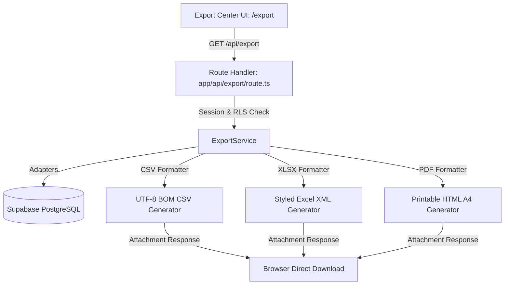

# PERSONAL OS — EXPORT SERVICE MODULE SPECIFICATION & ARCHITECTURE

## 1. TỔNG QUAN KIẾN TRÚC EXPORT SERVICE (EXPORT SERVICE ARCHITECTURE)

Module Xuất Dữ Liệu Tập Trung (Export Service Module) trong Personal OS cung cấp khả năng trích xuất toàn bộ dữ liệu cá nhân (Tasks, Projects, Calendar, Time Tracking, Weekly Analytics, Notes, Dashboard Summary) sang các định dạng **CSV (UTF-8 BOM)**, **Excel XML (XLSX)** và **Báo cáo in ấn A4 (PDF)** với font chữ Tiếng Việt Unicode chuẩn xác và bảo mật Supabase RLS 100%.

---

## 2. DANH SÁCH FORMAT MATRIX HỖ TRỢ

| Nguồn Dữ Liệu (Resource) | CSV (UTF-8 BOM) | Excel (XLSX) | Báo cáo PDF |
| ------------------------ | :-------------: | :----------: | :---------: |
| **Tasks** (Công việc)    |        ✓        |      ✓       |      ✓      |
| **Projects** (Dự án)     |        ✓        |      ✓       |      ✓      |
| **Calendar** (Lịch)      |        ✓        |      ✓       |      ✓      |
| **Time Tracking**        |        ✓        |      ✓       |      ✓      |
| **Weekly Analytics**     |        ✓        |      ✓       |      ✓      |
| **Notes** (Ghi chú)      |        ✓        |      ✓       |      ✓      |
| **Executive Dashboard**  |        —        |      ✓       |      ✓      |

---

## 3. ĐẶC TÍNH NỔI BẬT VỀ BẢO MẬT & ĐỊNH DẠNG

1. **Bảo mật RLS Isolation**: Mọi yêu cầu xuất dữ liệu đều được xác thực phiên người dùng từ Server-side Cookie Session (`auth.uid() = user_id`). Tuyệt đối không chấp nhận `user_id` giả lập từ Client.
2. **UTF-8 BOM cho CSV**: Tập tin CSV được bổ sung Byte Order Mark (`\uFEFF`) ở đầu file giúp Microsoft Excel trên Windows tự động mở đúng tiếng Việt có dấu mà không bị lỗi font font `font-encoding`.
3. **Excel XML Spreadsheet**: Định dạng SpreadsheetML cho phép Excel tạo các Header có màu sắc HSL, cố định dòng tiêu đề (Freeze Panes) và chia thành nhiều Worksheet (cho Analytics và Dashboard).
4. **Printable HTML A4 PDF**: Layout báo cáo A4 chuyên nghiệp, tối ưu typography tiếng Việt, có Header/Footer, bảng dữ liệu xen kẽ màu sắc và hộp chỉ số KPI nổi bật.
