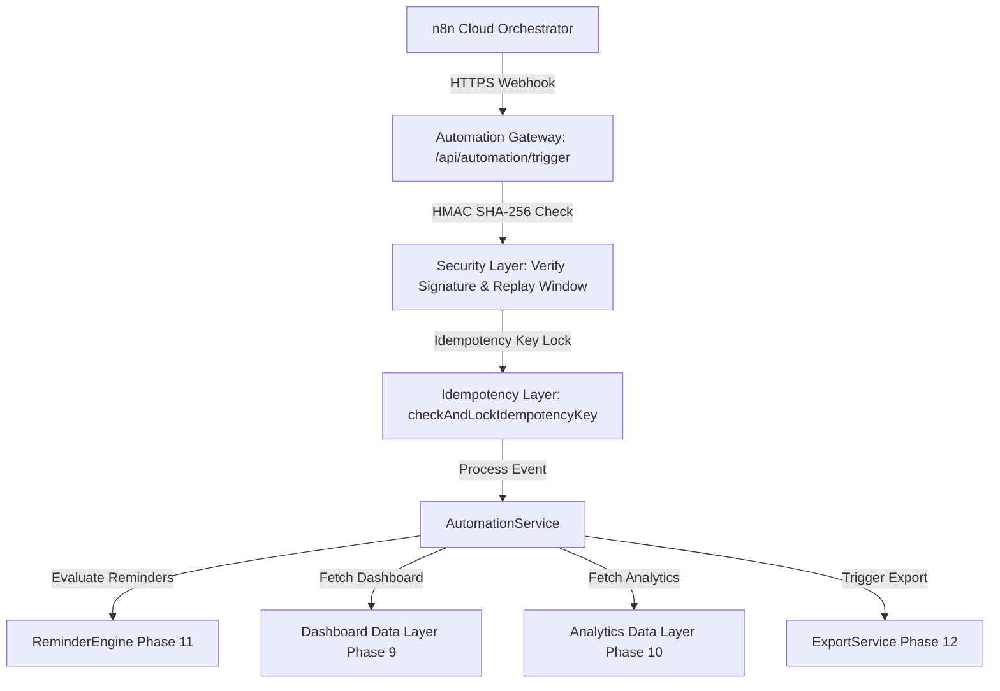

# PERSONAL OS — PHASE 13 n8n AUTOMATION & ORCHESTRATION ARCHITECTURE

## 1. TỔNG QUAN KIẾN TRÚC n8n ORCHESTRATION (n8n ARCHITECTURE)

Trong dự án Personal OS, **n8n Cloud** đóng vai trò duy nhất là **ORCHESTRATOR** (Hệ thống điều phối luồng). Toàn bộ Business Logic, Authentication, Authorization, Validation, RLS Policies và dữ liệu PostgreSQL thuộc kiểm soát 100% của Personal OS Server.



---

## 2. NGUYÊN TẮC BẢO MẬT WEBHOOK (WEBHOOK SECURITY CONTRACT)

1. **HMAC SHA-256 Signature Verification**:
   - Signature được tạo từ chuỗi Canonical: `timestamp + "." + rawBody` bằng khoảnh khóa bảo mật `N8N_WEBHOOK_SECRET`.
   - Headers bắt buộc: `X-PersonalOS-Timestamp`, `X-PersonalOS-Signature`, `X-PersonalOS-Idempotency-Key`.
2. **Replay Protection (Chống Gửi Lại Request Cũ)**:
   - Request bị từ chối lập tức nếu `abs(now - timestamp) > 300` (ngoài cửa sổ 5 phút).
3. **Idempotency Lock (Retry ≠ Duplicate Side-Effects)**:
   - Mỗi request mang `idempotency_key`. Hệ thống khóa bản ghi trong `automation_jobs`. Nếu n8n retry, server trả về kết quả đã xử lý mà **không phát sinh tác dụng phụ trùng lặp** (ví dụ: Không tạo 3 notification trùng nhau).
4. **Không Bypass RLS**:
   - n8n không bao giờ giữ `SUPABASE_SERVICE_ROLE_KEY`.

---

## 3. DANH MỤC WORKFLOWS (WORKFLOW CATALOG)

- **WF-01 Daily Reminder Evaluation**: Kích hoạt `ReminderEngine.evaluateReminders()` quét mốc hạn chót Task, Project, Event.
- **WF-02 Daily Digest**: Tạo bản tin tổng hợp công việc mỗi sáng từ Dashboard Data Layer.
- **WF-03 Deadline Watcher**: Theo dõi mốc hạn chót quan trọng.
- **WF-04 Overdue Escalation**: Chuyển tiếp công việc quá hạn sang thông báo nhắc nhở.
- **WF-05 Weekly Review Reminder**: Nhắc nhở người dùng thực hiện Tổng kết tuần vào Thứ 7.
- **WF-06 Weekly Analytics Snapshot**: Chốt dữ liệu phân tích tuần tự động qua `getWeeklyAnalytics()`.
- **WF-07 Export Automation**: Kích hoạt xuất báo cáo định kỳ qua `ExportService`.
- **WF-08 System Health & Recovery**: Theo dõi trạng thái tiến trình `automation_jobs`.

---

## 4. BIẾN MÔI TRƯỜNG (ENVIRONMENT VARIABLES)
```text
N8N_BASE_URL=https://your-instance.n8n.cloud
N8N_WEBHOOK_SECRET=your-secure-hmac-secret-key
N8N_REQUEST_TIMEOUT_MS=10000
N8N_SIGNATURE_TOLERANCE_SECONDS=300
```
