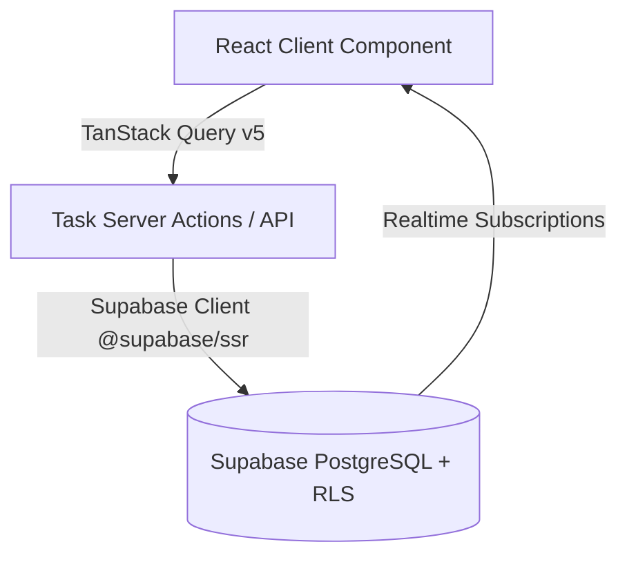

# PERSONAL OS — TASK MANAGEMENT MODULE SPECIFICATION & ARCHITECTURE

## 1. TỔNG QUAN HỆ THỐNG QUẢN LÝ CÔNG VIỆC (TASK MODULE ARCHITECTURE)

Module Quản lý Công việc (Task Management) được thiết kế làm **Trung tâm điều hành công việc cá nhân** cho Personal OS, đáp ứng tức thì 5 câu hỏi trọng tâm của người dùng:
1. Hôm nay tôi phải làm gì? -> View `Hôm nay` & Alert Overdue.
2. Việc nào quan trọng nhất? -> Priority badges `P0` Khẩn cấp & `P1` Cao nổi bật.
3. Việc nào sắp quá hạn? -> Cảnh báo mốc thời gian hạn chót màu đỏ/vàng.
4. Tôi đang làm gì? -> Trạng thái `Đang làm` (DANG_LAM) và Cột Kanban tương ứng.
5. Tôi đã hoàn thành được bao nhiêu? -> Checkbox 1-click & Tab `Hoàn thành`.

---

## 2. COMPONENT ARCHITECTURE & DESIGN SYSTEM

- **`app/(dashboard)/tasks/page.tsx`**: Main Task List View (Tất cả, Hôm nay, Tuần này, Quá hạn, Hoàn thành).
- **`app/(dashboard)/tasks/kanban/page.tsx`**: Dedicated Kanban Board Page.
- **`components/tasks/quick-add-task.tsx`**: Thanh tạo nhanh công việc (< 10 giây).
- **`components/tasks/task-row.tsx`**: Task row trong danh sách với Checkbox 1-click, Priority, Project, Tags, Due date.
- **`components/tasks/task-card.tsx`**: Card hiển thị trên cột Kanban hỗ trợ HTML5 Drag & Drop.
- **`components/tasks/task-kanban.tsx` & `task-kanban-column.tsx`**: 5 Cột Kanban (`Chưa làm`, `Đang làm`, `Chờ`, `Hoàn thành`, `Đã hủy`).
- **`components/tasks/task-form-sheet.tsx`**: Drawer/Sheet Tạo mới & Chỉnh sửa công việc có Zod validation.
- **`components/tasks/task-detail-sheet.tsx`**: Drawer/Sheet xem chi tiết metadata.
- **`components/tasks/task-filters.tsx`**: Tìm kiếm Debounce 300ms, Lọc Ưu tiên/Trạng thái & Sắp xếp.
- **`components/tasks/task-delete-dialog.tsx`**: Hộp thoại xác nhận xóa với nút Hủy và Xóa.

---

## 3. TANSTACK QUERY & REALTIME SYNCHRONIZATION STRATEGY

- **Optimistic UI Updates**: Khi người dùng tích Checkbox hoàn thành hoặc kéo thả Task trên Kanban, TanStack Query sẽ cập nhật dữ liệu tạm trong Cache ngay tức thì (0ms latency), sau đó gửi mutation ngầm tới Supabase. Nếu server gặp sự cố, UI tự động Rollback và hiển thị Toast thông báo tiếng Việt.
- **Realtime PubSub**: Đăng ký Supabase Realtime Channel trên bảng `tasks`. Khi có thay đổi từ thiết bị khác, hệ thống invalidate query key `['tasks']` để tải lại dữ liệu mới nhất mà không gây lặp đúp bản ghi.

---

## 4. QUY CHUẨN BẢO MẬT & RLS ENFORCEMENT

- Mọi câu lệnh SQL CRUD đều được ràng buộc bởi `user_id = auth.uid()` tại PostgreSQL RLS Layer.
- Server Actions kiểm tra quyền sở hữu đối với cả `project_id` và `tag_id` để đảm bảo User A không thể gán Task của mình vào Project hay Tag thuộc sở hữu của User B.
