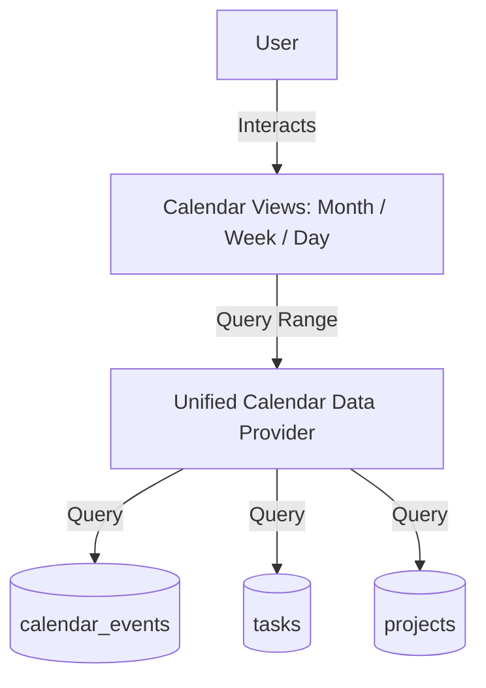

# PERSONAL OS — CALENDAR MODULE SPECIFICATION & ARCHITECTURE

## 1. TỔNG QUAN KIẾN TRÚC LỊCH CÁ NHÂN (CALENDAR ARCHITECTURE)

Module Lịch cá nhân (Calendar Module) là **Trung tâm quản lý thời gian** cho Personal OS, tích hợp 3 loại dữ liệu thời gian chính trên một giao diện thống nhất:
1. **SỰ KIỆN (Calendar Events)** (`calendar_events` table): Cuộc họp, lịch hẹn, thời gian cá nhân, ghi chú nhắc nhở. Hiển thị với ký hiệu `●`.
2. **CÔNG VIỆC (Tasks)** (`tasks` table từ Phase 4): Các task có `due_date`. Hiển thị với ký hiệu Checkbox `☐`. Click vào task mở trực tiếp `TaskDetailSheet` từ Phase 4.
3. **DEADLINE DỰ ÁN (Project Deadlines)** (`projects` table từ Phase 5): Các dự án có `deadline`. Hiển thị với ký hiệu `◆`. Click vào mở trực tiếp `/projects/[id]`.

---

## 2. CHẾ ĐỘ XEM & TÍNH NĂNG CHÍNH

- **Month View**: Lưới tháng từ Thứ Hai đến Chủ Nhật (`T2` -> `CN`). Xử lý tràn ô `+N mục khác` nếu ngày đó chứa > 3 mục.
- **Week View**: Lưới 7 ngày theo tuần có khung giờ `00:00` -> `23:00` và Đường đỏ chỉ mốc thời gian hiện tại (**Current Time Indicator Line**).
- **Day View**: Trục thời gian 1 ngày chi tiết `00:00` -> `23:59` kèm Đường đỏ chỉ thời gian hiện tại.
- **Tự Động Điền Giờ (Slot Prefilling)**: Nhấp vào bất kỳ ô ngày/giờ nào trên các chế độ xem sẽ tự động điền mốc `start_time` và `end_time` vào Form tạo sự kiện.
- **Nút Hôm nay (Today Shortcut)**: Đưa góc nhìn lịch về đúng ngày hiện tại dựa theo `user_settings.timezone` (`Asia/Ho_Chi_Minh`).

---

## 3. DANH SÁCH ROUTES & COMPONENTS

### Routes:
- `/calendar` — Trang trung tâm lịch cá nhân.

### Component Architecture:
- `components/calendar/calendar-month-view.tsx`
- `components/calendar/calendar-week-view.tsx`
- `components/calendar/calendar-day-view.tsx`
- `components/calendar/calendar-item-chip.tsx`
- `components/calendar/calendar-event-type-badge.tsx`
- `components/calendar/calendar-event-form-sheet.tsx`
- `components/calendar/calendar-event-detail-sheet.tsx`
- `components/calendar/calendar-event-delete-dialog.tsx`
- `components/calendar/calendar-filters.tsx`
- `lib/calendar/types.ts`
- `lib/calendar/schemas.ts`
- `lib/calendar/actions.ts`

---

## 4. BẢO MẬT RLS & REALTIME SYNCHRONIZATION

- Bảng `calendar_events` được bảo mật 100% bằng RLS `user_id = auth.uid()`.
- Supabase Realtime Channel lắng nghe trên cả 3 bảng `calendar_events`, `tasks`, `projects` để tự động làm mới giao diện lịch khi có sự thay đổi từ thiết bị khác.
