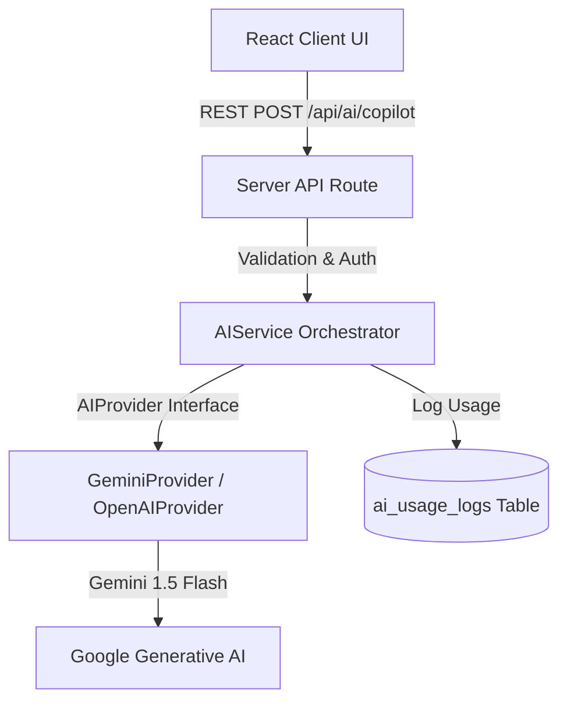

# PERSONAL OS — SMART NOTES & AI COPILOT MODULE SPECIFICATION & ARCHITECTURE

## 1. TỔNG QUAN KIẾN TRÚC GHI CHÚ THÔNG MINH & AI COPILOT

Module Ghi chú thông minh & AI Copilot (Smart Notes & AI Copilot Module) trong Personal OS được thiết kế như một **Trợ lý tri thức cá nhân**, kết hợp giữa trình soạn thảo Rich Text Tiptap và trí tuệ nhân tạo Gemini AI qua Lớp trừu tượng `AIService`.

---

## 2. NGUYÊN TẮC BẢO MẬT & AI ACTION CONFIRMATION FLOW

1. **AI Safety Principle**: AI Copilot tuyệt đối **KHÔNG** tự động khởi tạo Task hay thay đổi dữ liệu người dùng ngoài ý muốn.
2. **Luồng Xác Nhận Đề Xuất Task (AI Action Item Confirmation Flow)**:
   - AI phân tích nội dung Note và hiển thị bản xem trước: `AI đề xuất X công việc`.
   - Người dùng xem xét danh sách, tích chọn các công việc mong muốn.
   - Chỉ khi người dùng bấm `[Tạo các công việc đã chọn]`, hệ thống mới khởi tạo Task thực tế vào bảng `tasks` (tái sử dụng `createTaskAction` từ Phase 4).
3. **Lớp Trừu Tượng AI Layer (Pure Abstraction)**:
   - Giao diện UI không gọi trực tiếp SDK Gemini. Thao tác đi qua API Route server-side `POST /api/ai/copilot` -> `AIService` -> `AIProvider Interface`.
   - Dễ dàng mở rộng hoặc thay thế bằng OpenAI / Claude / Local LLM mà không cần thay đổi UI logic.
4. **Zod Structured Output Validation**:
   - Mọi kết quả trả về từ LLM đều được kiểm tra nghiêm ngặt qua Zod Schema (`aiCopilotOutputSchema`) trước khi phản hồi về Client.
5. **Ghi Nhật Ký Sử Dụng (`ai_usage_logs`)**:
   - Ghi nhận `user_id`, `provider`, `model`, `operation`, `input_tokens`, `output_tokens`, `estimated_cost`, `latency`, `status` cho mỗi yêu cầu AI.
   - **Tuyệt đối KHÔNG ghi nội dung nhạy cảm của Note vào bảng log**.

---

## 3. DANH SÁCH ROUTES & COMPONENTS

### Routes:
- `/notes` — Màn hình danh sách ghi chú (Grid view + Search + Pin filter).
- `/notes/[id]` — Màn hình soạn thảo ghi chú (Tiptap Rich Text + Debounced Autosave + AI Copilot Drawer).
- `POST /api/ai/copilot` — API Route Handler cho AI Copilot Server-side.

### Component Architecture:
- `components/notes/tiptap-editor.tsx` (Rich Text Editor + Checklist + Headings + Code Block + Autosave Indicator).
- `components/notes/ai-copilot-drawer.tsx` (AI Copilot Panel + Action Item Task Confirmation Flow).
- `components/notes/note-card.tsx`
- `components/notes/note-filters.tsx`
- `components/notes/note-delete-dialog.tsx`
- `lib/ai/types.ts`
- `lib/ai/provider.ts`
- `lib/ai/gemini-provider.ts`
- `lib/ai/ai-service.ts`
- `lib/notes/types.ts`
- `lib/notes/schemas.ts`
- `lib/notes/actions.ts`
