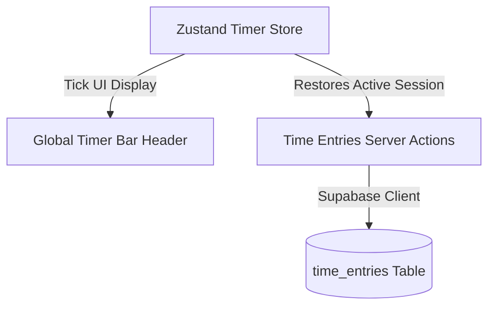

# PERSONAL OS — TIME TRACKING MODULE SPECIFICATION & ARCHITECTURE

## 1. TỔNG QUAN KIẾN TRÚC THEO DÕI THỜI GIAN (TIME TRACKING ARCHITECTURE)

Module Theo Dõi Thời Gian (Time Tracking Module) trong Personal OS được thiết kế để quản lý thời gian làm việc chính xác, minh bạch và nhất quán xuyên suốt ứng dụng:
1. **Database là Nguồn Sự Thật Duy Nhất (Single Source of Truth)**:
   - Các mốc thời gian `started_at`, `ended_at`, `duration_seconds` và `status` lưu trữ trực tiếp trong PostgreSQL.
   - Frontend Zustand Store (`lib/time/timer-store.ts`) chỉ thực hiện tính toán hiển thị `elapsedSeconds` từ mốc server `NOW() - started_at` (trừ khoảng paused).
   - Thao tác refresh trình duyệt, đổi trang hoặc đóng mở ứng dụng **tuyệt đối không reset đồng hồ về 00:00:00**.



---

## 2. MA TRẬN TRẠNG THÁI ĐỒNG HỒ (TIMER STATE MACHINE)

### Trạng thái (States):
- `IDLE`: Không có đồng hồ nào đang chạy.
- `RUNNING`: Đồng hồ đang đếm giờ ngầm.
- `PAUSED`: Tạm dừng đếm giờ (giữ nguyên duration tích lũy).
- `STOPPED`: Dừng và lưu bản ghi hoàn chỉnh vào Timesheet.

### Chuyển đổi trạng thái (Transitions):
- `IDLE` -> `RUNNING` (Start Timer)
- `RUNNING` -> `PAUSED` (Pause Timer)
- `RUNNING` -> `STOPPED` (Stop Timer)
- `PAUSED` -> `RUNNING` (Resume Timer)
- `PAUSED` -> `STOPPED` (Stop Timer)

### Ràng buộc duy nhất tại Database Level:
```sql
CREATE UNIQUE INDEX idx_unique_active_time_entry_per_user 
    ON public.time_entries (user_id) WHERE status IN ('running', 'paused');
```
*Ý nghĩa*: Mỗi người dùng tại một thời điểm chỉ có tối đa **01** đồng hồ đếm giờ hoạt động (`running` hoặc `paused`).

---

## 3. DANH SÁCH ROUTES & COMPONENTS

### Routes:
- `/time` — Trang trung tâm Timesheet theo dõi thời gian (Summary Cards + Week Selector + Daily Tabs + Timesheet Entries List + Filters).

### Component Architecture:
- `components/timer/global-timer.tsx` (Global Timer Bar tích hợp Header App Shell).
- `components/timer/start-timer-dialog.tsx` (Hộp thoại Bắt Đầu Đếm Giờ Nhanh).
- `components/timer/manual-entry-dialog.tsx` (Hộp thoại Thêm / Sửa Thời Gian Thủ Công).
- `components/timer/time-entry-row.tsx` (Dòng hiển thị Timesheet entry + format tiếng Việt "1 giờ 27 phút").
- `components/timer/time-filters.tsx` (Tìm kiếm Debounce 300ms, Filter Project & Billable).
- `components/timer/time-delete-dialog.tsx` (Hộp thoại xác nhận xóa bản ghi).
- `lib/time/types.ts`
- `lib/time/schemas.ts`
- `lib/time/actions.ts`
- `lib/time/timer-store.ts`

---

## 4. QUY CHUẨN BẢO MẬT & RLS ENFORCEMENT

- 100% truy vấn PostgreSQL trên bảng `time_entries` được bảo vệ bằng RLS: `auth.uid() = user_id`.
- Server Actions xác thực quyền sở hữu của `task_id` và `project_id` trước khi khởi tạo hoặc cập nhật Time Entry.
- Kiểm tra tính hợp lệ: Nếu Task thuộc Project A, Time Entry tuyệt đối không thể chọn nhầm Project B.
