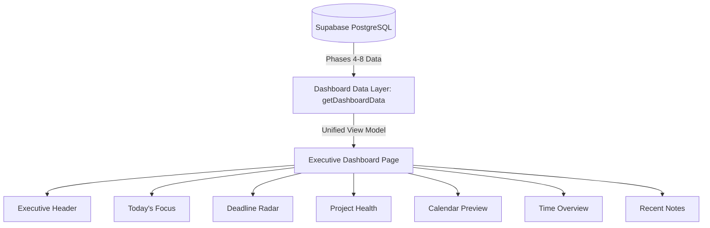

# PERSONAL OS — EXECUTIVE DASHBOARD SPECIFICATION & ARCHITECTURE

## 1. TỔNG QUAN KIẾN TRÚC TRUNG TÂM ĐIỀU HÀNH (DASHBOARD ARCHITECTURE)

Executive Dashboard trong Personal OS được thiết kế theo mô hình **Đầu não Điều hành Cốt lõi (Actionability > Information Density)**. Dashboard trả lời 4 câu hỏi trọng tâm của người dùng:
1. *Hôm nay tôi cần làm gì?* (Today's Focus)
2. *Deadline nào sắp đến hoặc đang nguy hiểm?* (Deadline Radar)
3. *Project nào cần chú ý?* (Project Health)
4. *Tôi đã sử dụng thời gian như thế nào?* (Time Overview & Live Timer)

---

## 2. NGUYÊN TẮC QUẢN LÝ DỮ LIỆU (DASHBOARD DATA LAYER PATTERN)

- **Tuyệt đối KHÔNG cho phép từng Widget tự query database**. Mọi dữ liệu đi qua một hàm thống nhất `getDashboardData()` tại `lib/dashboard/actions.ts` trên Server-side.
- **Không thay đổi Database Schema**: Dashboard hoàn toàn tổng hợp dữ liệu sẵn có từ Phase 4 (Tasks), Phase 5 (Projects), Phase 6 (Calendar), Phase 7 (Notes) và Phase 8 (Time Tracking).
- **Tái sử dụng Abstraction hiện có**:
  - `fetchCalendarItems` từ Phase 6 cho Deadline Radar & Calendar Preview.
  - `calculateProjectHealth` từ Phase 5 cho Project Health Widget.
  - `formatSummaryDuration` & `useTimerStore` từ Phase 8 cho Time Overview & Global Timer.
  - Task/Note/Event creation modals từ Phase 4/6/7/8 cho Quick Actions.

---

## 3. DANH SÁCH ROUTES & COMPONENTS

### Routes:
- `/dashboard` — Executive Dashboard Page chính.

### Component Architecture:
- `lib/dashboard/types.ts` (View Model Interfaces).
- `lib/dashboard/actions.ts` (Unified Data Layer fetcher).
- `components/dashboard/executive-header.tsx` (Greeting, Date, Summary badges & Quick Actions).
- `components/dashboard/todays-focus.tsx` (Top 5 focus tasks với P0/P1 badges).
- `components/dashboard/deadline-radar.tsx` (Rủi ro 7 ngày chia theo Overdue, Today, 48h, 7d kèm ký hiệu `●`, `☐`, `◆`).
- `components/dashboard/project-health-widget.tsx` (Tình trạng dự án + Progress bar + Health status).
- `components/dashboard/calendar-preview-widget.tsx` (Lịch luyện hôm nay).
- `components/dashboard/time-overview-widget.tsx` (Tổng thời gian hôm nay, Billable & Tuần).
- `components/dashboard/recent-notes-widget.tsx` (Top 5 ghi chú gần đây).
- `app/(dashboard)/dashboard/page.tsx` (Dashboard Hub Layout).

---

## 4. RESPONSIVE & VISUAL HIERARCHY

- **Desktop (2-Column Grid)**:
  - Cột Trái: Executive Header, Today's Focus, Project Health, Time Overview
  - Cột Phải: Deadline Radar, Calendar Preview, Recent Notes
- **Mobile (Single-Column Linear)**: Header -> Global Timer -> Today's Focus -> Deadline Radar -> Calendar -> Health -> Time -> Notes -> Quick Actions.
